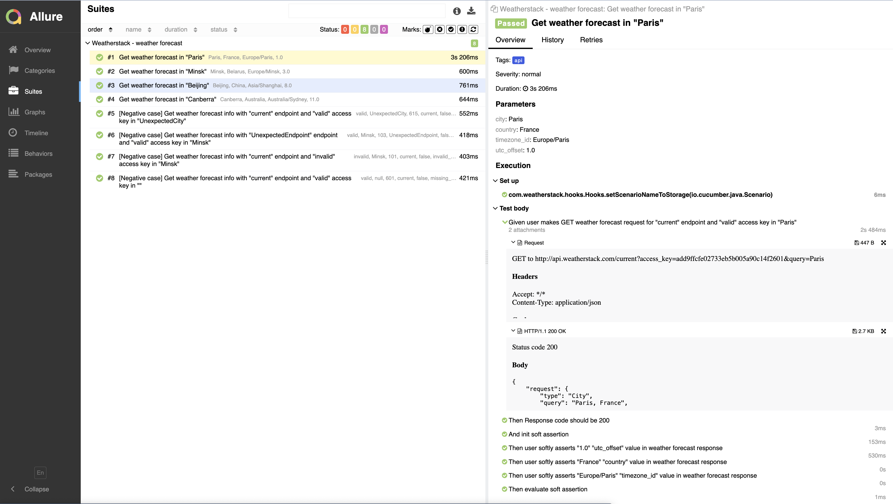

# API framework

## Table of contents

* [Environment](#environment)
* [How to run tests](#how-to-run-tests)

## Environment

1. Java 16 or later
2. Git
3. Gradle
4. REST Assured

## How to run tests

1. Set your access key to ``config.properties`` file here: ``api/src/test/resources/config.properties``

2. From command line from project's root: ``./gradlew clean tests -Dcucumber.tags="@api"``

3. Generate Allure Report: ``./gradlew allureReport``
   You can open Allure Report here: ``api/build/allureReport/index.html``
   